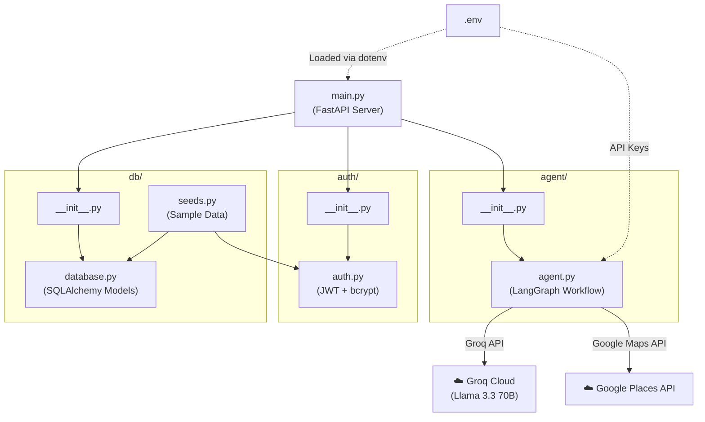

# YourCoolingPartner — Architecture & Directory Structure

This document explains the project directory layout, what each file does, and how they all connect to form the complete system.

---

## Directory Structure

```
YourCoolingPartner/
│
├── agent/                      # AI Agent Package
│   ├── __init__.py             # Exports: graph, AgentState
│   └── agent.py                # LangGraph multi-agent workflow
│
├── auth/                       # Authentication Package
│   ├── __init__.py             # Exports: verify_password, get_password_hash, create_access_token, etc.
│   └── auth.py                 # JWT token creation + bcrypt password hashing
│
├── db/                         # Database Package
│   ├── __init__.py             # Exports: SessionLocal, User, Job, Bid, Booking
│   ├── database.py             # SQLAlchemy engine, models (User, Job, Bid, Booking)
│   └── seeds.py                # Sample data seeder with verbose logging
│
├── docs/                       # Documentation
│   ├── AgentWorkflow.md        # Original agent design & node descriptions
│   ├── FastAPIImplementationPlan.md  # API endpoints & DB schema plan
│   └── architecture.md         # This file
│
├── main.py                     # FastAPI server — all API routes
├── requirements.txt            # Python dependencies
├── .env                        # API keys (GOOGLE_API_KEY, GROQ_API_KEY, GOOGLE_MAPS_API_KEY)
└── .gitignore                  # Ignores .env and other sensitive files
```

---

## How Files Interlink



---

## File-by-File Breakdown

### Root Level

| File | Role | Depends On |
| :--- | :--- | :--- |
| `main.py` | The FastAPI application. Defines all API routes (`/auth/login`, `/api/chat`, `/api/jobs`, `/api/bids`, `/api/bookings`). Starts the uvicorn server. | `db`, `auth`, `agent` |
| `requirements.txt` | Lists all Python packages needed to run the project. | — |
| `.env` | Stores secret API keys. Never committed to git. | — |
| `.gitignore` | Prevents `.env` and other files from being tracked by git. | — |

### `agent/` Package

| File | Role | Depends On |
| :--- | :--- | :--- |
| `__init__.py` | Re-exports `graph` and `AgentState` so `main.py` can simply do `from agent import graph`. | `agent.py` |
| `agent.py` | The core AI logic. Contains three LangGraph nodes and the compiled graph. Also has a standalone `__main__` terminal chat loop for testing. | Groq API, Google Maps API, `.env` |

#### Agent Nodes (Inside `agent.py`)

```
User Input
    │
    ▼
┌──────────────────────┐
│  Agent 1: Intent     │  ← Groq (Llama 3.3 70B)
│  Parsing Node        │  Extracts: intent, city, town
└──────────┬───────────┘
           │
     ┌─────┴─────┐
     │ All 3      │ No ──► Ask clarification ──► END
     │ fields     │        (returns to user)
     │ extracted? │
     └─────┬─────┘
       Yes │
           ▼
┌──────────────────────┐
│  Agent 2: Google     │  ← Google Places API (New)
│  Maps Search Node    │  Fetches 20 businesses
└──────────┬───────────┘
           │
           ▼
┌──────────────────────┐
│  Agent 3: Ranking    │  ← Groq (Llama 3.3 70B)
│  Node                │  Ranks top 10, formats in Roman Urdu
└──────────┬───────────┘
           │
           ▼
        END (Returns ranked list)
```

### `auth/` Package

| File | Role | Depends On |
| :--- | :--- | :--- |
| `__init__.py` | Re-exports auth functions so `main.py` can do `from auth import verify_password`. | `auth.py` |
| `auth.py` | Contains `get_password_hash()`, `verify_password()`, and `create_access_token()`. Uses bcrypt for hashing and python-jose for JWT. | `passlib`, `python-jose` |

### `db/` Package

| File | Role | Depends On |
| :--- | :--- | :--- |
| `__init__.py` | Re-exports all models and `SessionLocal` so `main.py` can do `from db import User, Job`. | `database.py` |
| `database.py` | Defines the SQLAlchemy engine (`sqlite:///yourcoolingpartner.db`) and all four ORM models: `User`, `Job`, `Bid`, `Booking`. Auto-creates tables on import. | `sqlalchemy` |
| `seeds.py` | Runnable script that inserts sample data (5 users, 4 jobs, 5 bids, 1 booking) with detailed console logs. | `database.py`, `auth.py` |

### `docs/` Folder

| File | Purpose |
| :--- | :--- |
| `AgentWorkflow.md` | Original design document for the 3-node LangGraph agent pipeline. |
| `FastAPIImplementationPlan.md` | API endpoints, DB schema, and integration strategy plan. |
| `architecture.md` | This file — explains how everything fits together. |

---

## Request Flow: What happens when the Android app calls `/api/chat`

```
Android App
    │
    │  POST /api/chat  { "message": "Mujhy AC repair chaiye" }
    │  Header: Authorization: Bearer <jwt_token>
    │
    ▼
┌─────────────────────────────────────────────┐
│  main.py                                    │
│                                             │
│  1. get_current_user() ──► auth/auth.py     │
│     (Decodes JWT, finds User in DB)         │
│                                             │
│  2. Loads/creates chat session from memory  │
│     (conversation_history, extracted fields) │
│                                             │
│  3. graph.invoke() ──► agent/agent.py       │
│     (Runs all 3 agents in sequence)         │
│                                             │
│  4. If clarification needed:                │
│     → Return { status: "clarifying" }       │
│                                             │
│  5. If complete:                            │
│     → Auto-create Job in db/database.py     │
│     → Return { status: "completed" }        │
└─────────────────────────────────────────────┘
```

---

## How to Run

```bash
# Install dependencies
pip install -r requirements.txt

# Seed the database with sample data
python -m db.seeds

# Start the FastAPI server
python main.py

# Open Swagger UI in browser
# http://localhost:8000/docs

# Or test the agent standalone in terminal
python -m agent.agent
```
